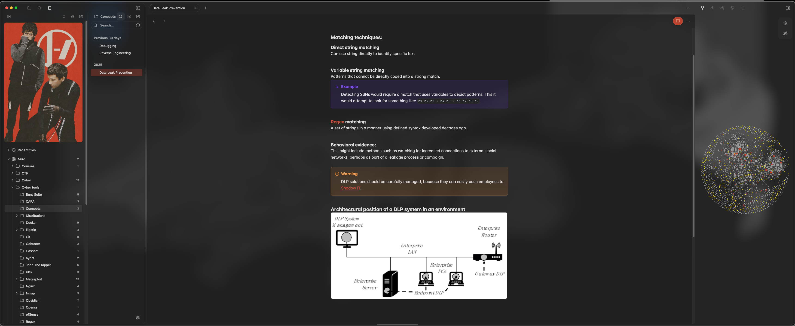
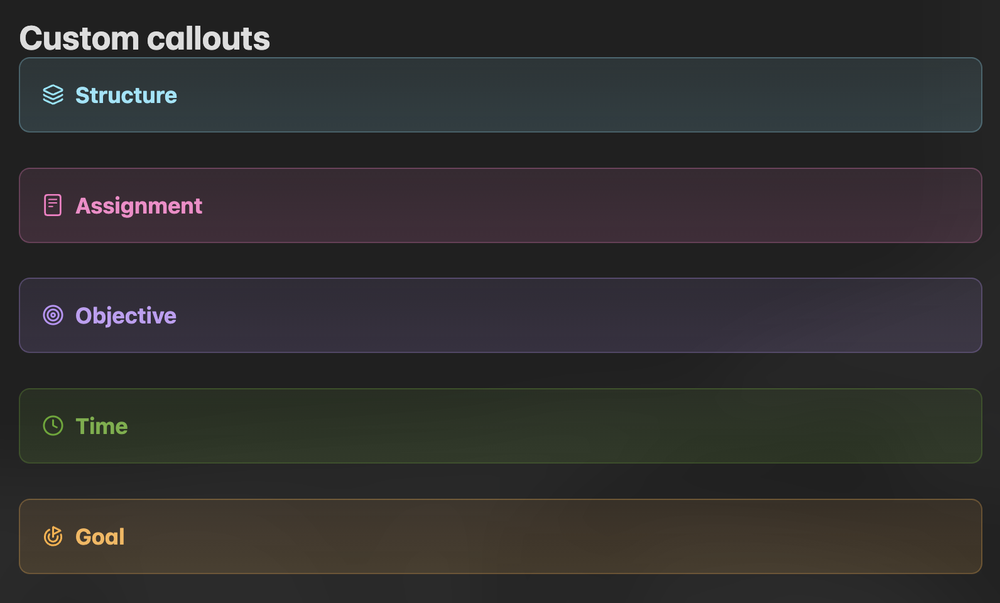

<div align="center">
  <h1 style="font-size:24px;">【Preview of Obsidian】</h1>
  

</div>

<div>
<h2 style="font-size:24px;">Prerequisites</h2>
Download the following plugins and themes in order to get as close 

- [The Notebook Navigator plugin](obsidian://show-plugin?id=notebook-navigator)
- [Cupertino Theme](https://github.com/aaaaalexis/obsidian-cupertino)
- [Style settings plugin](obsidian://show-plugin?id=obsidian-style-settings)

<h3 style="font-size:18px;">Optional but recommended:</h2>

- [0xProto Nerd Font](https://www.nerdfonts.com/font-downloads)
    - Not apart of the Obsidian ecosystem but It adds a nice font to code blocks that mirrors the [zshrc](../../zshrc/README.md) configuration for more consistency across the setup.

- [Image-toolkit](obsidian://show-plugin?id=obsidian-image-toolkit)
  - Allows you to select images and zoom in on them within the repository
- [Omnisearch](obsidian://show-plugin?id=omnisearch)
  - "Intelligent search into your notes, PDFs, and OCR for your images" 
- [Paste URL into selection](obsidian://show-plugin?id=url-into-selection)
  - Pasting links (including obsidian links) while highlighting text will create a hyperlink 
- [Paste image rename](obsidian://show-plugin?id=obsidian-paste-image-rename)
  - Allows you to auto-rename notes from something like "image-102190" to the note name, or rename it on the fly.
- [Multi tag](obsidian://show-plugin?id=multi-tag)
  - Allows you to tag entire directories/folders with the same tag + more.

</div>

<div>
<h2 style="font-size:22px;">This configuration includes</h2>

The image shown on the left-hand side, transparency, other misc folder sort, simple file style, fonts, [callouts](https://obsidian.md/help/callouts) and general layout of the vault.

<h2 style="font-size:22px;">Installation steps</h2>

To get close/exact look of this Obsidian vault the following must be set: 

  This is shown in JSON format (from `.obsidian/apperance.json`), but can just be set in the Obsidian settings GUI by hand.

```json
  "accentColor": "#c1412e",
  "showRibbon": false,
  "translucency": true,
  "nativeMenus": false,
  "monospaceFontFamily": "0xProto Nerd Font Mono",
  "baseFontSize": 16
```

---
1. Under community plugins tab in settings select *Style Settings* -> select  *Import* -> and paste in the JSON from `Style-settings.json`.
2. Under community plugins tab in settings select *Notebook Navigator* -> select *General* -> *Advanced* -> *Import* and paste in the JSON from `notebook-navigator-settings.json`.
3. Take the files from the `callouts-nodeColoring` directory, in settings -> *Appearance* -> *CSS Snippets* -> *Open snippets folder* and move them there -> Enable all snippets.
</div>

<footer>

>[!NOTE]
> This does not include *every* single detail from my Obsidian configuration, as I believe most won't make much use of it (e.g. Keybindings)

</footer>

