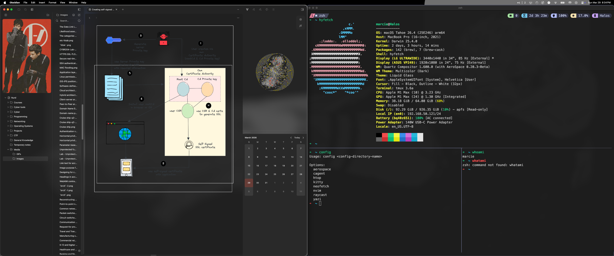

  <h1 align=center style="font-size:24px;">【Preview】</h1>
  

> [!NOTE]
> The image(s) shown here will not be representative of *all* changes made. For higher-quality or alternative screenshots (for example, the Tmux dotfiles), check the corresponding directory. These images aim to reflect the end-user experience but may not show every change. 

>[!WARNING]
> kitty theme selection does not function properly in conjunction with the `ZSH_TMUX_AUTOSTART` setting inside of `.zshrc` due to this, you can either configure the changes made to the colorscheme *first* then save the zshrc file OR you can simply take the files located in `kitty/` and replace them with your own instead of using the `kitten theme` CLI tool.
