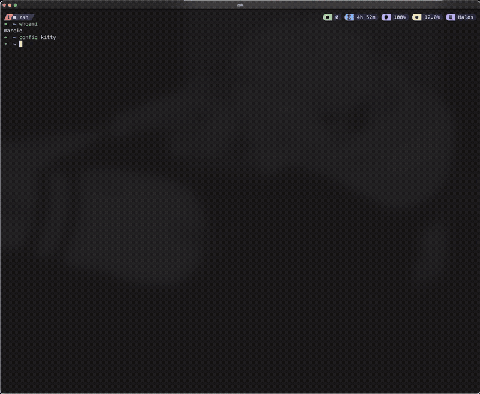

  <h1 align=center style="font-size:24px;">【Preview of Kitty】</h1>
  

>![WARNING]
> Check the main README as a issue concerning a theme used here may cause a road bump for your setup.

<h2 style="font-size:22px;">This configuration includes:</h2>
  The blur effect, cursor effects and shapes, fonts, colorscheme, etc.

<h2 style="font-size:22px;">Installation steps</h2>
  1. Copy all files and place inside of your own `~/.config/kitty/` directory. Full/force quiting' the application is necessary for the changes to take place. 

