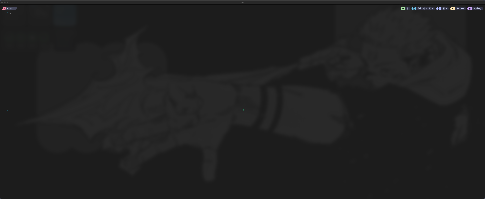

<div align="center">
  <h1 style="font-size:24px;">【Preview of Tmux】</h1>
  
</div>

<div>
<h2 style="font-size:22px;">Prerequisites</h2>

- [Git](https://git-scm.com/install/)
- [Tmux](https://github.com/tmux/tmux/wiki/Installing)

<h2 style="font-size:22px;">This configuration includes:</h2>
The little modules shown above (battery, runtime, cpu utilization, and their colors) as well as specific keybindings; the prefix key is set to `ctrl + \` so as to not interfere with terminal emulator keybindings like ctrl + a. Furthermore changes have been made for the splitting keys to follow the vim motions style (HJKL). 

<h2 style="font-size:22px;">Installation steps</h2>

1. Locate the TMUX configuration file (typically at `~/.tmux.conf`)
2. Place the <a href="./.tmux.conf"> Tmux configuration file from this repository </a>in your `~/.tmux.conf`
3. Next you need to clone [Tmux Plugin Manager (TPM)](https://github.com/tmux-plugins/tpm?tab=readme-ov-file#installation) in order to install and load tmux plugins. (Don't worry about adding those text blocks at the bottom of the configuration file as that has already been done.)
4. Next you must reload Tmux by either restarting/reloading with:
  ```bash
  tmux source ~/.tmux.conf
  ```
5. Next you need to use `prefix` + `I` to "fetch" / initialize the plugin(s) that are apart of this configuration. Then you should be good to go. 

<footer>
  <p>References/Sources:</p>
  <ul>
    <li><a href="https://github.com/tmux-plugins/tpm">Tmux Plugin Manager (TPM)</a><br></li>
    <li><a href="https://github.com/catppuccin/tmux">Catppuccin for Tmux</a></li>
  </ul>
</footer>
</div>
